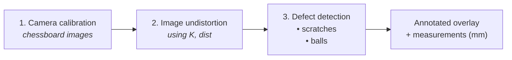

# AM_project — Glass surface defect inspection

Vision framework for the Advanced Measurements course. The goal is to detect and measure **scratches** and **balls** (spherical inclusions / contamination) on glass surfaces from camera images.

Because every measurement in pixels has to be converted into real-world units (mm), the pipeline starts with a **camera calibration** step that estimates the intrinsic matrix `K` and the lens distortion coefficients. Subsequent stages run defect detection on the undistorted frames.

## Pipeline overview



Stage 1 is implemented in [camera_calibration.ipynb](camera_calibration.ipynb). Stages 2-3 consume the `calibration_result.npz` produced by stage 1.

## Project layout

```
AM_project/
├── calibration.py             # Minimal script (corner detection only)
├── camera_calibration.ipynb   # Full calibration notebook — stage 1
├── requirement.txt            # Python dependencies
├── data/                      # YOUR images go here (gitignored)
│   ├── calibration/           #   chessboard pictures for stage 1
│   └── glass/                 #   pictures of the glass samples to inspect
└── README.md
```

## Create and start the virtual environment

```bash
# Run only once: create the virtual env
python3 -m venv myenv

# Activate it
# Linux / macOS:
source myenv/bin/activate
# Windows (cmd):
myenv\Scripts\activate.bat
# Windows (PowerShell):
myenv\Scripts\Activate.ps1
```

## Install the dependencies

```bash
pip install --upgrade pip
pip install -r requirement.txt
```

## Stage 1 — Camera calibration

### Prepare the calibration images

1. Print a chessboard pattern (e.g. the standard OpenCV 9x6 squares pattern, which has **8x5 inner corners**, or any other size you like). Mount it on a rigid flat surface.
2. Take 15-30 pictures of the board with the same camera (and same focal length / focus distance) that you will use to image the glass samples. Vary the pose: tilted left/right, near/far, rotated. Keep the whole board inside the frame.
3. Drop the pictures into `data/` (or `data/calibration/` if you prefer to separate them — just update `DATA_DIR` in the notebook).

> The `data/` folder is gitignored — you don't need to commit your images.

### Run the calibration notebook

```bash
jupyter notebook camera_calibration.ipynb
```

In the second cell, adjust the parameters to match your setup:

| Parameter | Meaning |
|-----------|---------|
| `DATA_DIR` | Folder containing the chessboard images. Default: `data/`. |
| `IMAGE_GLOB` | File extension to load. Default: `*.jpg`. |
| `CHESSBOARD_SIZE` | Number of **inner corners** `(cols, rows)`, *not* the number of squares. |
| `SQUARE_SIZE_MM` | Physical side of one square (mm). Set the real value so distances come out in mm. |
| `OUTPUT_FILE` | Path of the `.npz` archive that stores the result. |

Then run all the cells. The notebook will:

1. Load every image from `DATA_DIR`.
2. Detect and sub-pixel refine the chessboard corners.
3. Display a grid of annotated frames so you can verify the detection.
4. Call `cv.calibrateCamera` and print the camera matrix `K` and the distortion coefficients.
5. Plot the per-image re-projection error to help spot outlier shots.
6. Show an undistortion preview on a sample frame.
7. Save the result to `calibration_result.npz`.

### Re-use the calibration in later stages

```python
import numpy as np, cv2 as cv
data = np.load('calibration_result.npz')
K, dist = data['K'], data['dist']

img = cv.imread('data/glass/sample_01.jpg')
undistorted = cv.undistort(img, K, dist)
# → feed `undistorted` to the scratch / ball detector
```

## Stages 2-3 — Defect detection (work in progress)

The scratch and ball detection modules will be added next. They will:

- Operate on undistorted frames (using the `K`, `dist` produced by stage 1).
- Detect the balls defects and fit a circle to each of them. Detect the scratches and extrapolate a line to each of them.
- Or train a simple classifier to assign a confidence score to each detection (e.g. based on the average gradient magnitude along the scratch, or the contrast of the ball against the background).
- Output, for each defect, its centroid, length / diameter in millimetres, and a confidence score.
- Save an annotated overlay for visual inspection.

## Troubleshooting

- **`Pattern detected in 0 / N images`** — `CHESSBOARD_SIZE` is wrong. Count the *inner* corners along each direction, not the squares.
- **High RMS error (> 1 px)** — usually a few blurry or extreme-angle shots dominate. Inspect the per-image error bar plot and delete the worst frames from `data/`.
- **`Need at least 5 valid views`** — add more pictures with different orientations.
- **Measurements are off after detection** — make sure the camera used for the glass pictures has the *same* intrinsics as the one used for calibration (no zoom change, no autofocus jump, same resolution).
