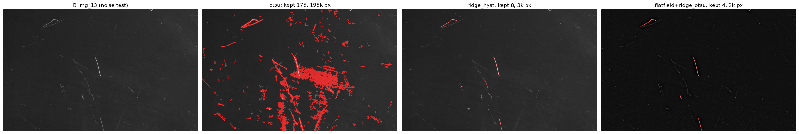

# Scratch Detection Framework — Documentation

Classical (non-deep-learning) image-processing pipeline that turns raw glass-surface
photos into **binary scratch masks**. The masks are intended as ground-truth labels
`Y` for a future U-Net segmentation model.

All of the code lives in the notebook [`scratch_detection.ipynb`](../scratch_detection.ipynb).
These docs describe the framework **as currently implemented**, including the parameter
defaults that were tuned on the `data_1` dataset.

| pixel value | meaning |
|---|---|
| `255` (white) | scratch |
| `0` (black) | background / dust / noise |

## The pipeline at a glance

```
                   ┌─────────────┐
 raw photo  ──────▶│  load_gray  │  red pen-mark removal (HSV gate + inpaint) → grayscale
                   └─────────────┘
                          │
                   ┌─────────────┐
                   │ preprocess  │  gaussian → median → CLAHE → {bgsub, top-hat, Frangi ridge}
                   └─────────────┘
                          │
                   ┌─────────────┐
                   │candidate_mask│ threshold (default: ridge_hysteresis) → binary candidate
                   └─────────────┘
                          │
                   ┌─────────────┐
                   │morphology_  │  opening (kill speckles) → closing (bridge gaps)
                   │   clean     │
                   └─────────────┘
                          │
                   ┌─────────────┐
                   │  filter_    │  8-connected components + geometric + skeleton gate
                   │ components  │  (drops dust grains, keeps long thin scratches)
                   └─────────────┘
                          │
                       M_final   (saved as {0,255} PNG, same name + shape as source)
```

The whole chain is wrapped by `build_mask(img, p) -> dict` and driven by a single
`Params` dataclass instance `P` — there are no hidden globals, so every stage is
reproducible from `P`.

## Documents

1. **[pipeline.md](pipeline.md)** — every stage explained in detail, with the math and
   the reasoning behind each operator.
2. **[thresholding.md](thresholding.md)** — the eight thresholding methods, the
   illumination problem that made the default `otsu` fail, and **why `ridge_hysteresis`
   is now the recommended/default method** (with measured evidence).
3. **[parameters.md](parameters.md)** — full `Params` reference: every knob, its default,
   what it controls, and how to tune it.

## Key takeaway: `ridge_hysteresis` is the best detector here

The default threshold method was changed from `otsu` to **`ridge_hysteresis`** because
global Otsu floods on glasses with uneven illumination / surface texture. The Frangi
ridge filter keys on line *shape* (Hessian eigenvalue ratios), not absolute brightness,
so it stays robust under uneven lighting. On the two worst images the noise collapsed by
~30–50× while real scratches were preserved:

| image | `otsu` (old default) | `ridge_hysteresis` @ 0.03/0.12 (new default) |
|---|---|---|
| B/img__13 (noisy) | 195 589 mask px · 175 components | **3 904 px · 17** |
| C/img__10 (noisy) | 183 659 mask px · 262 components | **14 k px · 47** |
| A/img__57 (recall test) | fat false blobs | 27 k px · 46 clean thin scratches |



See [thresholding.md](thresholding.md) for the full comparison and tuning guidance.

## Data layout (`data_1/`)

```
data_1/
├── raw_images/            # single-image development sample (img__0.png)
├── generated_masks/       # masks from the §9 single-folder batch
├── debug_outputs/         # 4-panel debug strips
└── dataset/
    ├── train/
    │   ├── images/{A,B,C}-<timestamp>/<label>/img__*.png   # 128 / 127 / 149 photos
    │   └── masks/...                                        # mirrored output tree
    ├── val/
    │   ├── images/validation-<timestamp>/validation/img__*.png   # 152 photos
    │   └── masks/...
    └── test/
```

The export nests each glass inside a timestamped folder; the helper
`list_glass_images()` groups PNGs back by glass label (`A`/`B`/`C`/`validation`).

## How to run

1. Open `scratch_detection.ipynb` and **Restart Kernel & Run All** (so the `Params`
   cell is freshly executed — the QA cell prints the active `threshold_method` to
   confirm it is `ridge_hysteresis`).
2. **§12 — Mask QA**: visualises 6 random images (2 per glass) as
   `original | cleaned mask | final overlay`.
3. **§13 — Illumination robustness**: the Otsu-vs-ridge comparison that motivated the
   default change.
4. **§12 — Batch** (`process_split`): applies the pipeline to all train + val images and
   writes masks to the mirrored `masks/` trees.
