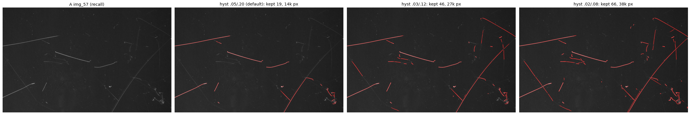
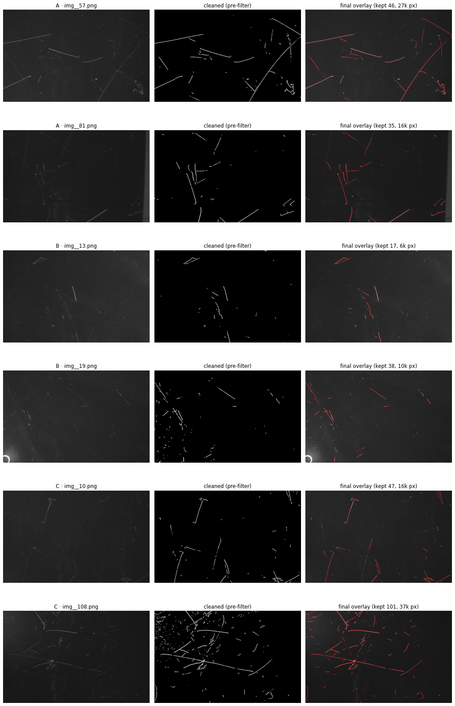
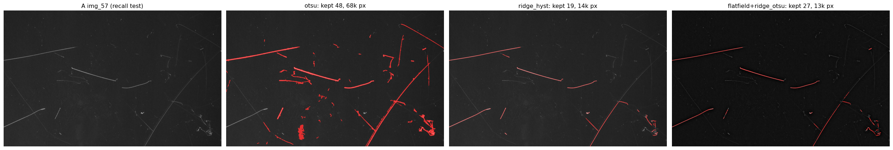

# Thresholding — the eight methods and why `ridge_hysteresis` wins

The thresholding stage (`candidate_mask`, §4) turns a preprocessed image into a binary
candidate mask. It dispatches on `p.threshold_method`. This is the **single most
consequential knob** in the framework, and the reason the masks were noisy before.

## The eight methods

| `threshold_method` | operates on | idea | brightness-invariant? |
|---|---|---|---|
| `fixed` | CLAHE image | global constant `T = fixed_thresh` | ❌ |
| `otsu` | CLAHE image | global Otsu (min within-class variance) | ❌ |
| `adaptive` | CLAHE image | Gaussian local mean − C | partly |
| `tophat_otsu` | top-hat | Otsu on morphological residual | partly |
| `bgsub_otsu` | bgsub | Otsu on background-subtracted residual | partly |
| `ridge_otsu` | Frangi response | Otsu on vesselness (stretched first) | ✅ |
| **`ridge_hysteresis`** ⭐ | Frangi response | two-level hysteresis on vesselness | ✅ |
| `hysteresis` | CLAHE image | hysteresis directly on CLAHE | ❌ |

**Default: `ridge_hysteresis`.**

### Otsu (the old default)
Picks $T^\star = \arg\min_T\, w_0(T)\sigma_0^2(T) + w_1(T)\sigma_1^2(T)$. This assumes a
**bimodal histogram** — a clean valley between "background" and "scratch" intensities.

### Frangi + hysteresis (the new default)
Two cutoffs $T_\text{low} < T_\text{high}$ on the Frangi response:

- pixels above $T_\text{high}$ are **seeds**;
- pixels above $T_\text{low}$ join the mask **only if 8-connected to a seed**.

The cutoffs are interpreted as **fractions of the per-image peak Frangi response**
(`_normalize_to_unit` rescales each image to its own max). This is what lets a single pair
of numbers transfer across images of very different absolute contrast. Defaults:
`hyst_low=0.03`, `hyst_high=0.12` — seeds at 12 % of the strongest ridge, grown down to
3 %.

---

## The problem: why `otsu` produced noisy masks

On glasses with **uneven illumination + surface texture** (e.g. `B/img__13`,
`C/img__10`), the intensity histogram has **no clean valley**: a cloudy low-frequency
brightness field plus fine texture spread the pixel values out. Otsu then picks a
threshold that marks **huge regions as foreground**. CLAHE makes it worse by amplifying
the texture before Otsu ever sees it.

The result is "flooding" — the mask fills with tens of thousands of false-positive pixels
that the downstream component filter cannot fully remove (the texture forms large
elongated clusters that pass the geometric gate).

*Left→right: original · `otsu` (massive red flood) · `ridge_hysteresis` (clean thin
scratches) · `flatfield + ridge_otsu`.*

---

## The fix: detect by *shape*, not by *brightness*

The Frangi ridge response is built from **ratios of Hessian eigenvalues**, so it is
largely invariant to absolute brightness and responds to the *geometry* of a thin ridge.
It simply does not fire on smooth illumination gradients or isotropic texture. Switching
the threshold to operate on the Frangi response (`ridge_hysteresis` / `ridge_otsu`)
removes the flooding without any per-image retuning.

### Measured evidence

Final-mask pixel counts (lower = less flooding; the clean control should stay
non-trivial, proving real scratches are kept):

| image | `otsu` | `ridge_hysteresis` | `flatfield + ridge_otsu` |
|---|---|---|---|
| B/img__13 (noisy) | 195 589 px · 175 comp | **3 904 · 8** | 2 767 · 4 |
| C/img__10 (noisy) | 183 659 px · 262 comp | **6 496 · 18** | 8 430 · 31 |
| C/img__108 (clean ctrl) | 73 280 px · 111 comp | 24 455 · 59 | 12 696 · 28 |

→ **30–50× less noise** on the bad glasses, while the clean control still retains a
healthy mask. (These were measured at the original `0.05/0.20` cutoffs; the final default
`0.03/0.12` is slightly more permissive — see below.)

---

## Optional second lever: flat-field correction

`flatfield_gray(gray, ksize=101)` (defined in §13) divides the image by a heavy Gaussian
blur of itself — a homomorphic-style estimate of the illumination field `L`:

$$
\text{flat} = \frac{I}{L}, \qquad L = \text{GaussianBlur}(I,\,k),\; k \gg \text{scratch width}
$$

**Division** (not subtraction) cancels the *multiplicative* vignetting / cloudy brightness
field. It is a secondary improvement on top of the ridge filter — useful where the
lighting gradient is severe — but the ridge detector alone already removes most of the
flooding, so flat-field is optional.

---

## Tuning the hysteresis cutoffs (recall vs precision)

`ridge_hysteresis` is **precision-first**: it produces clean thin labels but can miss the
very faintest scratches. Recall is recovered by **lowering** the cutoffs. A sweep on three
images:

| cutoffs `hyst_low/hyst_high` | A/img__57 (recall) | B/img__13 (noise) | C/img__10 (noise) |
|---|---|---|---|
| `0.05 / 0.20` (original) | 19 comp · 14k px | 8 · 3k | 16 · 6k |
| **`0.03 / 0.12` (default)** | **46 · 27k** | **17 · 4k** | **47 · 14k** |
| `0.02 / 0.08` (max recall) | 88 · 38k | 32 · 11k | 65 · 23k |

`0.03/0.12` was chosen as the default: it recovers most faint scratches on `A/img__57`
(19 → 46 components) while the noisy glasses stay clean (~4k / 14k px, vs Otsu's ~190k).
Drop toward `0.02/0.08` if faint scratches still go missing, at the cost of a little more
speckle.

*Final §12 QA with the new default — flooding gone on B/img__13 and C/img__10, real
scratches preserved as clean thin lines across all glasses.*

---

## Why precision-first is the right choice here

These masks are **training labels for a U-Net**, not the final product:

- Clean, precise labels (even if missing a few faint scratches) teach the network the
  scratch concept correctly.
- Flooded, noisy labels teach the network to reproduce the noise — *garbage in, garbage
  out.*

So a detector that errs toward precision (`ridge_hysteresis`) is strictly better as a
label generator than one with high recall but poor precision (`otsu`). If higher recall is
later needed, it is cheaper to loosen the hysteresis cutoffs or hand-correct a few masks
than to denoise flooded ones.

*Even on a scratch-rich image, `otsu` (2nd panel) paints fat blobs over the scratches —
wrong, since scratches are thin — while the ridge methods trace them as accurate 1-px-wide
centrelines. Precise geometry is exactly what a segmentation network should learn from.*

---

## Practical notes

- **Always confirm the active method.** The §12 QA cell prints
  `using threshold_method='...'`. If it says `otsu`, the kernel is holding a stale `P` —
  re-run the §8 `Params` cell (or Restart & Run All).
- The detector is the **only** change needed; everything downstream (morphology,
  component filter, skeleton gate) is unchanged and works on the cleaner candidate.
- For a brand-new glass with different optics, re-run §13 (`compare_illumination`) on a
  couple of its worst images before trusting the defaults.
